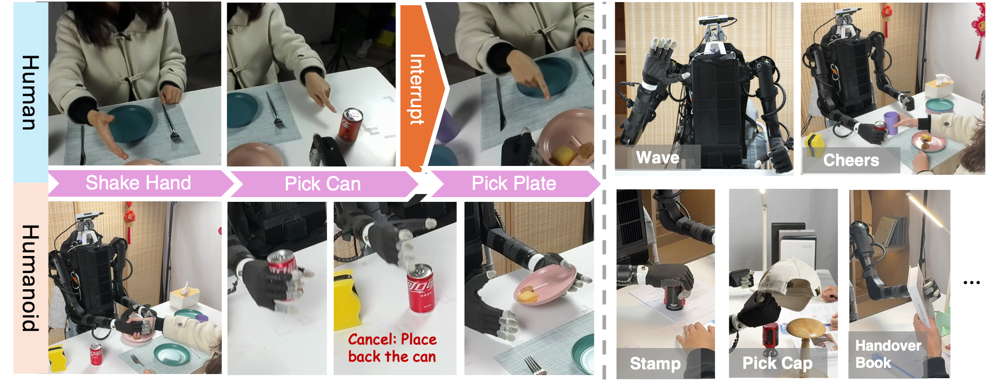

<h1 align="center"> RHINO: Learning Real-Time 

Humanoid-Human-Object Interaction <br> from Human Demonstrations</h1>

<p align="center">
    <a href="https://timerchen.github.io/"><strong>Jingxiao Chen*</strong></a>
    ·
    <a href="https://github.com/lixinyao11/"><strong>Xinyao Li*</strong></a>
    ·
    <a href="https://scholar.google.com/citations?&user=ofpwpDYAAAAJ/"><strong>Jiahang Cao*</strong></a>
    ·
    <a href="https://zbzhu99.github.io/"><strong>Zhengbang Zhu</strong></a>
    ·
    <a href="https://github.com/WentDong/"><strong>Wentao Dong</strong></a>
    <br>
    <a href="https://minghuanliu.com/"><strong>Minghuan Liu</strong></a>
    ·
    <a href="https://yingwen.io/"><strong>Ying Wen</strong></a>
    ·
    <a href="https://apex.sjtu.edu.cn/members/yyu/"><strong>Yong Yu</strong></a>
    ·
    <a href="https://bcmi.sjtu.edu.cn/~zhangliqing/"><strong>Liqing Zhang</strong></a>
    ·
    <a href="https://wnzhang.net/"><strong>Weinan Zhang</strong></a>
</p>

<p align="center">
<h3 align="center"><a href="https://humanoid-interaction.github.io/">Website</a> | <a href="https://arxiv.org/abs/2502.13134">arXiv</a> | <a href="https://youtu.be/Ps7dIM_cYqI">Video</a> | <a href="https://x.com/ericliuof97/status/1891921410442002753">Summary</a> </h3>

  <div align="center"></div>
</p>
<p align="center">

</p>

## 🎉 News
- [2025/03] We have released rgb video of human interaction data! Please check [here](docs/extra_human_video.md).
- [2025/02] Original release!

## ⚙️ Installation
### Overview of Running Environments
Here is an overview of the environments to be installed and their respective purposes:

1. **deploy_control**: 
    - **Usage**: Inference for control nodes.
    - **Setup**: Clone `ros_env`, install HaMeR, ZED Python API, and other dependencies.

2. **planner_motion**:
    - **Usage**: Inference and training for motion planning.
    - **Setup**: Clone `ros_env`, install PyTorch and other dependencies.

3. **tv**:
    - **Usage**: Data collection, inference, and training for the TeleVision module.
    - **Setup**: Clone `ros_env`, install dependencies from OpenTeleVision.

4. **Docker for Robot Hardware**:
    - **Usage**: Inference for robot hardware control.
    - **Setup**: Install Docker, pull ROS Docker image, build and run the container, compile and build SDK inside the container.

Each environment is tailored to specific parts of the RHINO system, ensuring modularity and ease of management.
### Conda
#### 0. ROS Environment Setup

Create a conda environment `ros_env` following the [RoboStack guide](https://robostack.github.io/).

This will serve as the base conda environment for all the following environments we used.

> We use **Robot Operating System (ROS)** to facilitate communication across various modules of the robot. To improve compatibility with conda environments, we utilize a virtual environment based on the [Robostack](https://robostack.github.io/) framework. The system is deployed on **Ubuntu 22.04** with **ROS 2 Humble Hawksbill**.

#### 1. deploy_control

##### Usage
- *inference*:
    - `deploy_control/ros_node/zed_react_node.py`  

1. Clone ROS env.
```shell
conda create -n deploy_control --clone ros_env
conda activate deploy_control
```
2. Install HaMeR.

We recommend you to use [our fork of HaMeR](https://github.com/TimerChen/hamer) and download the trained models and install the dependencies according to the README.

Note that HaMeR need to be cloned directly under the `RHINO` directory.

3. Install ZED Python API following the [official guide](https://www.stereolabs.com/docs/app-development/python/install).

4. Install other dependencies.

```shell
pip install ultralytics
pip install scipy==1.10.1
pip install webdataset
pip install h5py
```

5. If you are encountering numpy issues such as `TypeError: expected np.ndarray (got numpy.ndarray)`, try reinstalling numpy with pip:

```shell
pip uninstall numpy
pip install numpy==1.23.0
```

#### 2. motion_planner

##### Usage
- *train*
    - `planner_motion/tools/train.py`
    - `planner_motion/tools/train_classifier.py`
- *inference*:
    - `planner_motion/tools/react_node.py`  

1. Clone ROS env.
```shell
conda create -n planner_motion --clone ros_env
conda activate planner_motion
```
2. Install dependencies
```shell
cd planner_motion
conda install pytorch==1.13.1 torchvision==0.14.1 torchaudio==0.13.1 pytorch-cuda=11.7 -c pytorch -c nvidia
pip install -r requirements.txt
```

#### 3. tv
##### Usage
- *process_data*:
    - `post_process_teleop_data.py`
- *train*:
    - `TeleVision/act/imitate_episodes.py`
- *inference*:
    - `TeleVision/scripts/manip_node.py`
    - `deploy_control/ros_nodes/arm_safe_node.py`


1. Clone ROS env.
```shell
conda create -n tv --clone ros_env
conda activate tv
```
2. Install dependencies following [OpenTeleVision](https://github.com/OpenTeleVision/TeleVision.git).

```shell
cd TeleVision
pip install -r requirements.txt
cd act/detr && pip install -e .
```

3. Install ZED Python API following the [official guide](https://www.stereolabs.com/docs/app-development/python/install).

### Docker for Robot Hardware

To ensure a stable and reproducible compilation environment, we package the robot's code in a Docker container.

#### Usage
- *inference*:
    - `deploy_control/ros_nodes/control_node.py`
    - `deploy_control/ros_nodes/safe_node.py`

#### Steps to Set Up Docker Environment:


1. Install [Docker](https://docs.docker.com/get-docker/).
2. pull the docker image with ROS environments.
```
docker pull osrf/ros2
```
3. Build and run the Docker container, mapping serial devices and device paths. The following command starts a bash shell inside the container with the ROS environment:
```bash
docker run --name rhino -it \
           --device=/dev/ttyUSB0:/dev/ttyUSB0 \
           --device=/dev/ttyUSB1:/dev/ttyUSB1 \
           --device=/dev/ttyACM0:/dev/ttyACM0 \
           -v /host/path:/container/path \
           osrf/ros2 \
           bin/bash
```
4. Compile and build the SDK and related packages inside the container by following the latest instructions provided by the hardware service. The official SDK for the robot is available at [Unitree SDK](https://github.com/unitreerobotics/unitree_sdk2_python).

## 📚 Datasets

### Download data and supplimentaries

We offer a HuggingFace repo in <https://huggingface.co/datasets/TimerChen/RHINO>, of which the README file represents dataset descriptions.

Download the dataset as a sub-directory `rhino_data` of this repository:

1. Decompress the dataset with small files

```bash
cd rhino_data/
tar -xzvf data/motion_data/motion_data.tar.gz
```

2. Create symlink for assets and checkpoints

```bash
ln -s rhino_data/motions_processed planner_motion/motions_processed
ln -s rhino_data/h1_assets deploy_control/h1_assets
ln -s rhino_data/yolo_ckpts deploy_control/zed_module/yolo_ckpts
```

### process the manipulation data for training

We recommend a two-step pipeline to process the data for the manipulation module:  

1. Step 1: Generate Viewable Videos (`--only-video`) 
   Convert raw data captured by the ZED camera into playable videos (`.mp4` files). This allows you to:  
   - Verify recording quality  
   - Perform manual annotation (e.g., labeling key frames or actions).  

2. Step 2: Compile Training Data (`--with-label`)
   After manual annotation, run this step to consolidate all training-ready data (including labels) into `.hdf5` files.
   Some hyper-parameter is assigned in `process_config.yaml` to make labels more memorizeble and reasonable for specific subset.


```bash
cd deploy_control
python scripts/post_process_teleop_data.py --root rhino_data/data/manipulation_data/ --task pick_can --only-video --overwrite
python scripts/post_process_teleop_data.py --root rhino_data/data/manipulation_data/ --task pick_can --with-label --overwrite --config rhino_data/data/manipulation_data/process_config.yaml
```

## 🚀 Training

### 1. interactive motion generation model

```bash
cd planner_motion
python train.py --tconf configs/train_30_10.yaml --epiname EXPERIMENT_NAME
```

### 2. classifier in react planner

```bash
cd planner_motion
python train_classifier.py --dtype EXPERIMENT_NAME --mconf "configs/model_train/classifier_his30_rh0.yaml" --hd_input "hand_pos" "hand_near" "head_pos" --better-state --hand-iou-mean-pool --obj-mask-ratio 0.2
```

### 3. manipulation module

Since datasets and code are typically stored in separate directories, and processed datasets are often very large, we recommend using soft (symbolic) links to import the required data into the training directory. 
A script is provided for this purpose, which can be used as follows:

```bash
cd TeleVision
python scripts/load_data_soft.py \
    --src_dir rhino_data/data/manipulation_data/ \
    --dst_dir data/recordings/ \
    --config rhino_data/data/manipulation_data/train_config.yaml \
    --overwrite
```

Then start the training using the integrated training script:

```bash
cd TeleVision
python train.py --exptid 01-task-name-date-lr --config rhino_data/data/manipulation_data/train_config.taml
```

Logs and checkpoints would be saved to the sub-directory of `data/logs` with the save name as the skill id (taskid).
We suggest that `exptid` starts with the prefix of the name of the skill (see `train_config.yaml`).

For better control of the training hyper-parameters, we also provide the usage of the original comand for training, here is an example:

```bash
cd TeleVision/act
python imitate_episodes.py --policy_class ACT --kl_weight 10 \
--chunk_size 30 --hidden_dim 512 --batch_size 45 --dim_feedforward 3200 --num_epochs 50001 \
--lr 5e-5 --seed 0 --taskid 01 --exptid 01-task-name-date-lr --backbone dino_v2 \
--state_name "head" "arm" "wrist" "hand"  --left_right_mask "11"  --progress_bar 25
```

Modify `taskid` and `exptid` before training new skills.
 e.g. `--taskid 01 --expitd 01-task-name-date-lr`. left-right-mask indicates that this task use which of the two arms: `10` for the left arm only, `01` for the right arm only and `11` for using both.

## 🤖 Deployment

### 1. the robot control modules

**In terminal 1**: start the robot arm, wrist and head control.

```bash
cd deploy_control
python ros_nodes/control_node.py --manip
```

**In terminal 2**: start the dexterous hand control.

```bash
cd deploy_control/h1_inspire_service
./inspire_hand -s SERIAL_OF_INSPIRE_HAND
```

where the serial can be found by `ls /dev/tty*`

### 2. the RHINO framework modules

**In terminal 3**: run the ZED sensing module.

```bash
cd deploy_control
python ros_nodes/zed_react_node.py --use_camera --vis
```

**In terminal 4**: run the motion generation module.

```bash
cd deploy_control
python ros_nodes/react_node.py

**In terminal 5**: run the manipulation module.

```bash
cd deploy_control
python ros_nodes/manip_node.py --react --skill-cancel
```

Add `--skill-cancel` arguments to enable the cross-task interruption.

### 3. the safe module (optional)

**In terminal 6**: run the safe module

```bash
cd deploy_control
python ros_nodes/arm_safe_node.py
```

## 🙏 Acknowledgements

This code builds upon following open-source code-bases. Please visit the URLs to see the respective LICENSES:
1. https://github.com/tonyzhaozh/act
2. https://github.com/facebookresearch/detr
3. https://github.com/dexsuite/dex-retargeting
4. https://github.com/vuer-ai/vuer
5. https://github.com/OpenTeleVision/TeleVision
6. https://github.com/geopavlakos/hamer
7. https://github.com/tr3e/InterGen
8. https://github.com/stephane-caron/pink


## 📖 Citation

```latex
@article{rhino2025chen,
  author    = {Chen*, Jingxiao and Li*, Xinyao and Cao*, Jiahang and Zhu, Zhengbang and Dong, Wentao and Liu, Minghuan and Wen, Ying and Yu, Yong and Zhang, Liqing and Zhang, Weinan},
  title     = {RHINO: Learning Real-Time Humanoid-Human-Object Interaction from Human Demonstrations},
  journal   = {arXiv preprint arXiv:2502.13134},
  year      = {2025},
}
```
